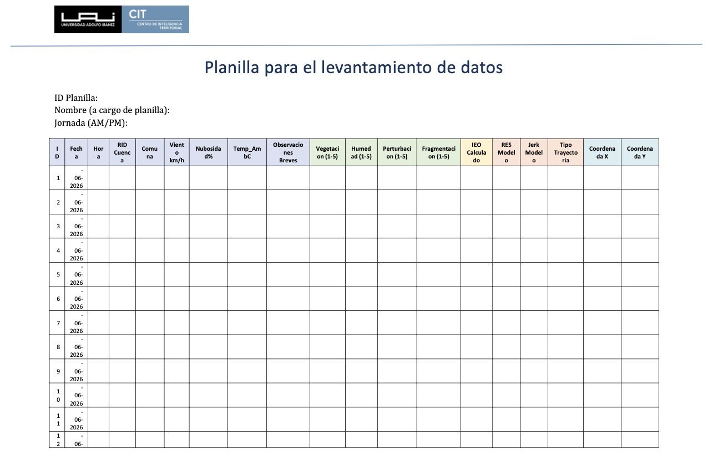

La ficha es el vínculo entre la cuenca, la observación y el resultado. Reúne la precarga MRCT y el registro de terreno sin repetir la selección de cuencas (@sec-tabla-cuencas-seleccionadas) ni la rúbrica IEO (@sec-rúbrica-ieo).

## Uso de la ficha {#sec-variables-obligatorias-fichas}

Cada ficha conserva cuatro bloques de información. Los campos se completan desde la cartera operativa y desde la visita, de modo que ningún dato se interpreta fuera de su `RID` y fecha.

| Bloque | Campos esenciales | Fuente |
|---|---|---|
| Identificación | `RID`, cuenca, comuna, fecha, hora, responsable y jornada | Cartera operativa y registro de sitio. |
| Precarga MRCT | `RES`, jerk, trayectoria, coordenada objetivo y criterio de selección | Análisis MRCT y fichas de cuencas seleccionadas. |
| Observación | Coordenada observada, acceso, clima, representatividad y observaciones breves | Terreno. |
| IEO y evidencia | Puntos de muestreo, V-H-P-F, fotografías, estado de dron y respaldo | Terreno y gabinete. |

: Campos mínimos de una ficha de cuenca. {#tbl-campos-minimos-ficha}

## Ficha tipo por cuenca {#sec-ficha-tipo-cuenca}

| Campo | Cómo se registra |
|---|---|
| Identificador de planilla | Código único asociado al `RID` y a la fecha. |
| Ubicación | Coordenada objetivo y coordenada efectiva del punto de observación. |
| Condiciones de visita | Viento, nubosidad, temperatura, acceso y visibilidad. |
| Representatividad | Relación entre el punto visitado y el polígono completo de la cuenca. |
| Índice IEO | Entre 5 y 10 puntos con notas de vegetación, humedad, perturbación y fragmentación. |
| Evidencia | Fotografías, operación o suspensión de dron, y observaciones relevantes. |
| Cierre | Preguntas de validación, incidencias y confirmación de respaldo. |

: Estructura de la ficha utilizada para cada cuenca. {#tbl-ficha-identificacion-mrct}

## Uso posterior {#sec-uso-posterior-fichas}

La ficha alimenta la síntesis de @sec-resultados-por-cuenca-terreno y la lectura de consistencia de @sec-criterios-consistencia-mrct. También permite distinguir una cuenca no visitada, un sitio con acceso restringido y una observación realizada con evidencia parcial, sin confundir esas situaciones con la condición ambiental de la cuenca.
