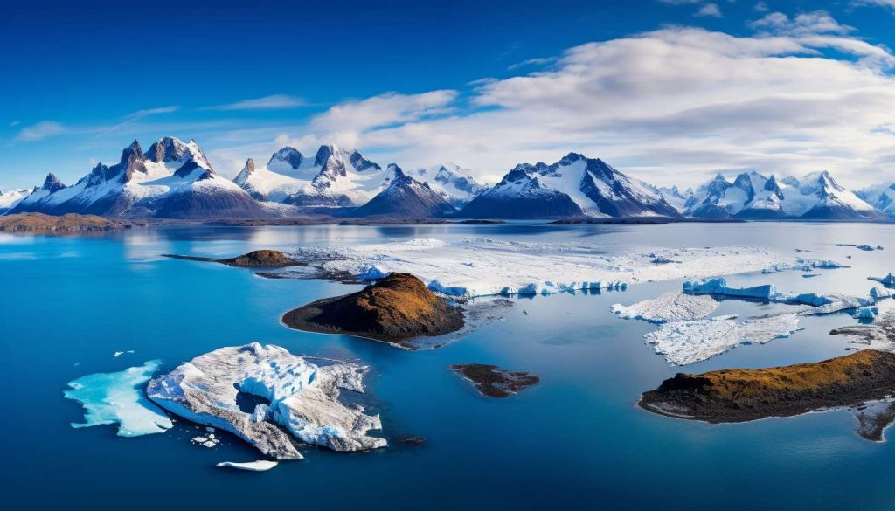

El modelo parte de la superficie terrestre. Antes de construir cualquier indicador necesita una representación física del territorio, año a año, en términos espectrales y radiométricos. Esa representación son los mosaicos satelitales.

Este capítulo describe la fuente de datos utilizada, las seis variables que componen el flujo anual, los criterios de control de calidad y el procedimiento de alineamiento que garantiza coherencia entre capas.

## Región de Estudio

La Región de Magallanes y de la Antártica Chilena se ubica en el extremo austral de Chile y constituye uno de los territorios más extensos, remotos y ambientalmente heterogéneos del país. Su sector sudamericano se extiende aproximadamente entre los 48°36' y 56°30' de latitud sur, y entre los 66°25' y 75°40' de longitud oeste. Administrativamente se organiza en cuatro provincias —Última Esperanza, Magallanes, Tierra del Fuego y Antártica Chilena— y once comunas, con Punta Arenas como capital regional.[^mag-bcn]

{#fig-mapa-region-magallanes fig-align="center" width="90%"}

La región posee una superficie total de **1.382.291,10 km²**, de los cuales **132.291,10 km²** corresponden al territorio sudamericano y **1.250.000 km²** al Territorio Chileno Antártico. Para efectos de este libro, el levantamiento satelital y la construcción de indicadores se concentran en las cuencas hidrográficas del sector sudamericano. Esta delimitación permite trabajar sobre unidades territoriales comparables, con continuidad espacial y pertinencia para el análisis ecosistémico regional.

Desde el punto de vista físico, Magallanes reúne archipiélagos, fiordos, canales, cordones montañosos, campos de hielo, estepas frías, turberas, bosques subantárticos, lagos, glaciares y extensas zonas costeras. Esta diversidad produce contrastes marcados entre el occidente húmedo y fragmentado por canales, el eje cordillerano y glaciar, y el oriente más seco y estepario. Para la MRCT, esa heterogeneidad es central: los indicadores de vegetación, agua, nieve, aridez, temperatura y estructura del paisaje se leen dentro de un mosaico ecológico de alta variabilidad interna.

{#fig-fiordos-magallanes fig-align="center" width="90%"}

El clima regional es templado frío, ventoso y de baja amplitud térmica, con abundante nubosidad y máximos invernales de precipitación. Hacia el oriente de la cordillera predominan condiciones estepáricas frías, con menor humedad y mayor exposición al viento. Esta gradiente climática incide directamente en la lectura satelital: la nubosidad reduce ventanas de observación; la nieve y el hielo modifican la reflectancia superficial; las diferencias de humedad alteran la señal hídrica y vegetal; y los contrastes térmicos se expresan en la temperatura superficial observada.[^mag-sinca]

La hidrografía regional presenta una organización singular. Buena parte de los cursos principales se ubican hacia el sector oriental o transandino y varios sistemas drenan finalmente hacia el Atlántico. Entre las hoyas relevantes se encuentran los ríos Serrano, Gallegos, Chico o Ciaike, San Juan y otras cuencas menores al sur del Estrecho de Magallanes. El río Serrano, asociado al Campo de Hielo Sur y al sistema de lagos Toro, Sarmiento, Pehoé y Nordenskjöld, es un ejemplo de la conexión entre criósfera, lagos, escorrentía y paisaje glaciar.[^mag-hidro]

La criósfera es uno de los componentes ambientales más importantes para comprender la resiliencia regional. Según el Inventario Público de Glaciares informado por la Dirección General de Aguas, Magallanes concentra **7.055 glaciares** y una superficie glaciarizada de **10.426,6 km²**, equivalente a casi la mitad de la superficie glaciarizada nacional. Por esta razón, la fracción nival, el albedo, la temperatura superficial y los cambios en agua superficial son variables especialmente relevantes para seguir transformaciones ecosistémicas asociadas a pérdida de hielo, variabilidad hídrica y cambios de cobertura.[^mag-dga]

{#fig-iceberg-magallanes fig-align="center" width="90%"}

El valor ecológico de Magallanes también se expresa en su alto nivel de protección ambiental. La región concentra la mayor extensión de territorio protegido de Chile y contiene áreas de conservación, parques nacionales, reservas, monumentos naturales, ecosistemas marinos, bosques subantárticos, turberas y ambientes glaciares. Esta condición refuerza la necesidad de indicadores reproducibles que permitan observar cambios territoriales sin depender únicamente de campañas de terreno, especialmente en zonas de difícil acceso.[^mag-sbap]

{#fig-pinguinos-magallanes fig-align="center" width="90%"}

La dimensión social y demográfica agrega otra capa de contexto. El Censo 2024 registró **166.537 personas** en la región, con una estructura altamente concentrada en centros urbanos y una densidad muy baja si se considera la superficie total regional. Punta Arenas y Natales concentran la mayor parte de la población, mientras amplios sectores rurales, insulares y de estepa presentan baja ocupación permanente. Este patrón de poblamiento influye en la presión territorial, en la accesibilidad para validación de campo y en la forma en que los resultados de la MRCT pueden apoyar decisiones públicas.[^mag-ine]

La base económica regional combina actividades urbanas, portuarias, logísticas, turísticas, ganaderas, energéticas e industriales. La extracción de hidrocarburos y gas natural, la ganadería ovina, el turismo de naturaleza y los servicios asociados a conectividad austral conviven con áreas de alto valor ecológico y baja intervención directa. En términos de resiliencia territorial, esta combinación exige distinguir entre cambios ecosistémicos propios de la variabilidad climática, transformaciones asociadas a presión productiva y dinámicas espaciales vinculadas a infraestructura, accesibilidad y ocupación humana.

En este contexto, los insumos satelitales cumplen una función metodológica clave. Permiten observar de manera homogénea un territorio extenso, climáticamente complejo y con fuertes restricciones logísticas. La MRCT usa esa observación anual para construir una lectura integrada de las cuencas: primero como señal física de superficie, luego como indicadores ecosistémicos y finalmente como trayectoria de resiliencia territorial.

| Dimensión regional | Relevancia para la MRCT |
|---|---|
| Gran extensión y baja densidad poblacional | Requiere monitoreo remoto sistemático y comparable. |
| Gradiente oeste-este de humedad y estepa | Afecta vegetación, agua superficial, aridez y temperatura. |
| Presencia de glaciares, nieve y campos de hielo | Hace centrales los indicadores de criósfera, albedo y agua. |
| Alta nubosidad y clima ventoso | Condiciona la construcción de mosaicos anuales robustos. |
| Cuencas con drenajes complejos | Justifica trabajar con unidades hidrográficas como base territorial. |
| Áreas protegidas y ecosistemas sensibles | Exige trazabilidad y cautela en la interpretación de cambios. |
| Poblamiento concentrado y territorios aislados | Refuerza el valor de productos cartográficos para gestión pública. |

## Fuente de datos

La fuente principal son los mosaicos **Landsat 8** del Servicio Geológico de los Estados Unidos (USGS). Landsat 8 opera desde 2013 con el sensor OLI (*Operational Land Imager*) y el sensor TIRS (*Thermal Infrared Sensor*), lo que lo hace el sensor de acceso libre con capacidad simultánea de registrar información óptica multibandal y temperatura superficial a **30 metros de resolución**.

El modelo cubre el período **2013–2025**, con un mosaico por año. La cobertura territorial corresponde a las cuencas hidrográficas de la Región de Magallanes y de la Antártica Chilena, un territorio con alta variabilidad ecosistémica y sensibilidad a los efectos del cambio climático sobre hielo, vegetación y régimen hídrico.

La frecuencia de revisita de Landsat 8 es de 16 días. Los mosaicos anuales se construyen como composites de mediana temporal: para cada píxel se toma la mediana de todos los valores observados durante el año. Esto reduce el efecto de perturbaciones puntuales como nubes o sombras residuales y entrega una representación estable del estado superficial anual.

::: {.callout-note}
## En términos simples

Cada año, el satélite registra múltiples veces las mismas cuencas. Se sintetiza toda esa información en un único mapa anual por variable, usando la mediana de los valores observados. El resultado es una imagen robusta, representativa del comportamiento promedio del ecosistema durante ese año.
:::

## Variables de entrada

El flujo anual trabaja con seis capas espectrales derivadas de los mosaicos Landsat 8. Cada una captura un aspecto diferente de la superficie y es la base de uno o más indicadores del modelo.

### NDVI — Índice de Vegetación de Diferencia Normalizada

$$\text{NDVI} = \frac{\rho_{NIR} - \rho_{Red}}{\rho_{NIR} + \rho_{Red}}$$

Donde $\rho_{NIR}$ y $\rho_{Red}$ son las reflectancias de superficie en la banda infrarroja cercana (Banda 5) y en la banda roja (Banda 4) respectivamente. La vegetación activa refleja con intensidad en el infrarrojo y absorbe en el rojo, lo que produce valores altos. Rangos típicos van de −1 a 1; valores por encima de 0,2 son consistentes con presencia de vegetación activa.

### NDWI — Índice de Agua de Diferencia Normalizada

$$\text{NDWI} = \frac{\rho_{Green} - \rho_{NIR}}{\rho_{Green} + \rho_{NIR}}$$

El NDWI amplifica la señal de agua superficial usando la banda verde (Banda 3) y el infrarrojo cercano. Valores positivos indican presencia de agua o humedad; valores negativos corresponden a suelos secos o vegetación sin estrés hídrico. Es la capa base para los indicadores hídricos del modelo.

### NDSI — Índice de Nieve de Diferencia Normalizada

$$\text{NDSI} = \frac{\rho_{Green} - \rho_{SWIR}}{\rho_{Green} + \rho_{SWIR}}$$

El NDSI aprovecha la alta reflectancia de la nieve en el verde visible (Banda 3) y su baja reflectancia en el infrarrojo de onda corta (Banda 6). Valores superiores a 0,4 son consistentes con cobertura de nieve o hielo. Es el insumo directo del indicador de criósfera.

### NDDI — Índice de Déficit Hídrico de Diferencia Normalizada

$$\text{NDDI} = \frac{\text{NDVI} - \text{NDWI}}{\text{NDVI} + \text{NDWI}}$$

El NDDI combina la señal vegetal y la hídrica para capturar tensión hídrica o condiciones de aridez relativa [@gu2007]. Cuando la vegetación es activa pero el agua escasa, el NDDI toma valores altos. Es el insumo del indicador de aridez (IA) y participa también en la estimación de sensibilidad climática.

### ALB — Albedo superficial

El albedo mide la fracción de radiación solar incidente que la superficie refleja. Se calcula como una combinación ponderada de las reflectancias en las bandas del visible e infrarrojo cercano. Superficies como nieve o suelo desnudo claro presentan albedo alto; vegetación densa y agua presentan albedo bajo. Variaciones en el albedo medio de una cuenca reflejan cambios en la composición superficial.

### TB — Temperatura de brillo

La temperatura de brillo corresponde a la señal térmica de la Banda 10 del sensor TIRS, convertida a grados Celsius. Es la temperatura aparente que tendría un cuerpo negro emitiendo la misma radiancia que la superficie observada. Constituye el proxy directo de la carga térmica superficial de cada unidad territorial.

---

La @tbl-capas resume las características de cada capa y sus usos en el modelo.

| Capa | Bandas Landsat 8 | Rango utilizado | Indicadores derivados |
|------|-----------------|-----------------|----------------------|
| NDVI | Banda 5 (NIR), Banda 4 (Red) | −1 a 1 | VEG, IRV, estructura del paisaje |
| NDWI | Banda 3 (Green), Banda 5 (NIR) | −1 a 1 | WA, HUM, IEH |
| NDSI | Banda 3 (Green), Banda 6 (SWIR) | −1 a 1 | PN |
| NDDI | Derivado de NDVI y NDWI | −5 a 5 | IA |
| ALB | Combinación multibanda | 0 a 1 | ALB |
| TB | Banda 10 (TIRS) | °C | TB |

: Capas satelitales anuales del modelo MRCT. El NDDI se recorta a ±5 durante el control de calidad. {#tbl-capas}

## Control de calidad

Primero se limpia la señal. Después se calcula. Esa es la regla que estructura el preprocesamiento.

Antes de derivar cualquier indicador, el modelo aplica una secuencia de filtros sobre las capas de cada año.

**Verificación de disponibilidad.** Se comprueba que las seis capas existan para el año en cuestión. Si falta cualquiera de ellas, el año se descarta en su totalidad. No se interpola ni se sustituye desde años adyacentes.

**Propagación de valores no válidos.** Todos los rasters se leen como valores de punto flotante de 32 bits. Los valores `NaN` —producidos por nubes, sombras no enmascaradas o bordes de escena— se propagan a lo largo del procesamiento y nunca participan en el cálculo de indicadores.

**Recorte de valores anómalos en NDDI.** El NDDI puede producir valores extremos cuando ambos índices son simultáneamente cercanos a cero. Para mitigarlo, se registran los percentiles 1 y 99 de la distribución anual y se aplica un recorte simétrico a ±5, reteniendo más del 98% de la distribución observada y eliminando artefactos numéricos.

**Umbral de cobertura mínima.** Una vez aplicadas las máscaras territoriales, se cuenta el número de píxeles válidos dentro del área de análisis. Si ese número es inferior a 1.000 píxeles, el año se omite. Este umbral garantiza que los estadísticos por cuenca tengan representatividad mínima.

## Alineamiento espacial

Todos los rasters deben compartir exactamente la misma grilla espacial: igual resolución, mismo origen, misma proyección cartográfica y misma extensión. Sin esa condición, la comparación píxel a píxel entre capas introduce errores de registro que contaminan los indicadores derivados.

La grilla de referencia es la del raster de cuencas (`basins_aligned.tif`). Al cargar cada capa anual, el modelo compara automáticamente su grilla con la de referencia. Si coinciden, la capa se usa directamente. Si no, se reproyecta usando el método de vecino más cercano, que conserva los valores originales sin introducir interpolaciones artificiales entre clases espectrales.

```{mermaid}
flowchart LR
    A[Imágenes satelitales<br/>Landsat 8] --> B[Selección temporal<br/>2013–2025]
    B --> C[Control de disponibilidad<br/>6 capas por año]
    C --> D[Filtrado de NaN<br/>y recorte de outliers]
    D --> E[Alineamiento espacial<br/>a grilla de referencia]
    E --> F[Mosaicos anuales<br/>validados]
    F --> G[Capas listas<br/>para indicadores]
```

[^mag-bcn]: Biblioteca del Congreso Nacional de Chile, [Región de Magallanes y Antártica Chilena](https://www.bcn.cl/siit/siit/nuestropais/region12).
[^mag-sinca]: Ministerio del Medio Ambiente, SINCA, [Información general de la Región de Magallanes y Antártica Chilena](https://sinca.mma.gob.cl/index.php/region/info/id/XII).
[^mag-hidro]: Biblioteca del Congreso Nacional de Chile, [Hidrografía Región de Magallanes](https://www.bcn.cl/siit/nuestropais/region12/hidrografia.htm).
[^mag-dga]: Dirección General de Aguas, [DGA Magallanes destaca crecimiento de la red de estaciones de monitoreo de aguas subterráneas y glaciares](https://dga.mop.gob.cl/dga-magallanes-destaca-crecimiento-de-la-red-de-estaciones-de-monitoreo-de-aguas-subterraneas-y-glaciares-en-la-region/).
[^mag-sbap]: Servicio de Biodiversidad y Áreas Protegidas, [SBAP comienza a operar en la región de Magallanes](https://sbap.gob.cl/sala-de-prensa/noticias-y-comunicados/detalle/2026/02/10/servicio-de-biodiversidad-y-%C3%A1reas-protegidas-comienza-a-operar-en-la-regi%C3%B3n-de-magallanes).
[^mag-ine]: Instituto Nacional de Estadísticas, [Resultados regionales Censo 2024: Magallanes y de la Antártica Chilena](https://censo2024.ine.gob.cl/wp-content/uploads/2025/04/12.-Infografia_Magallanes.pdf).
