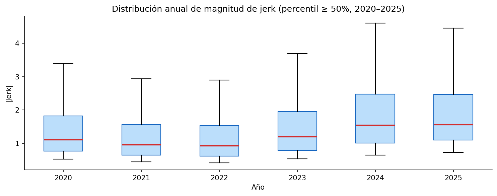
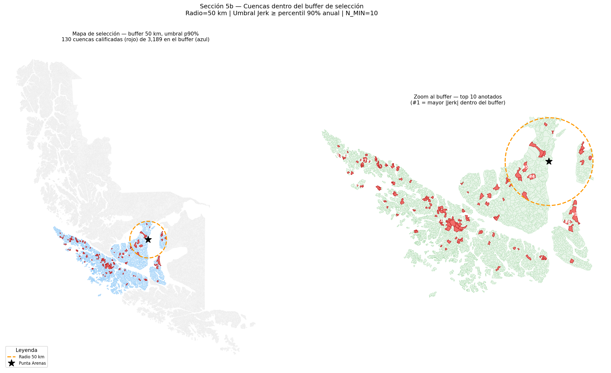
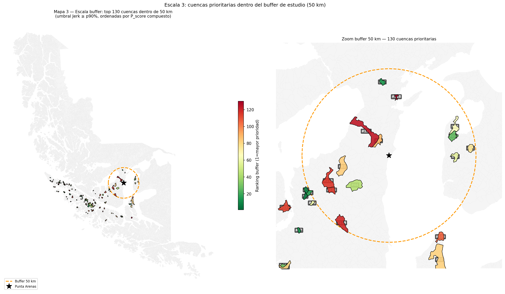
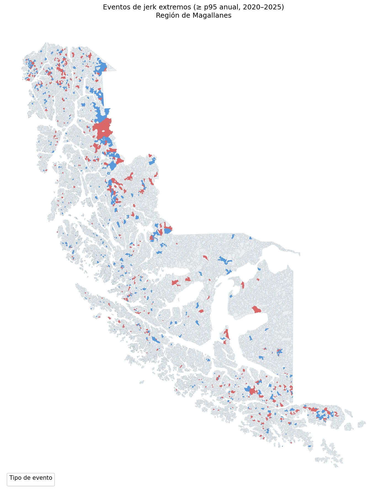
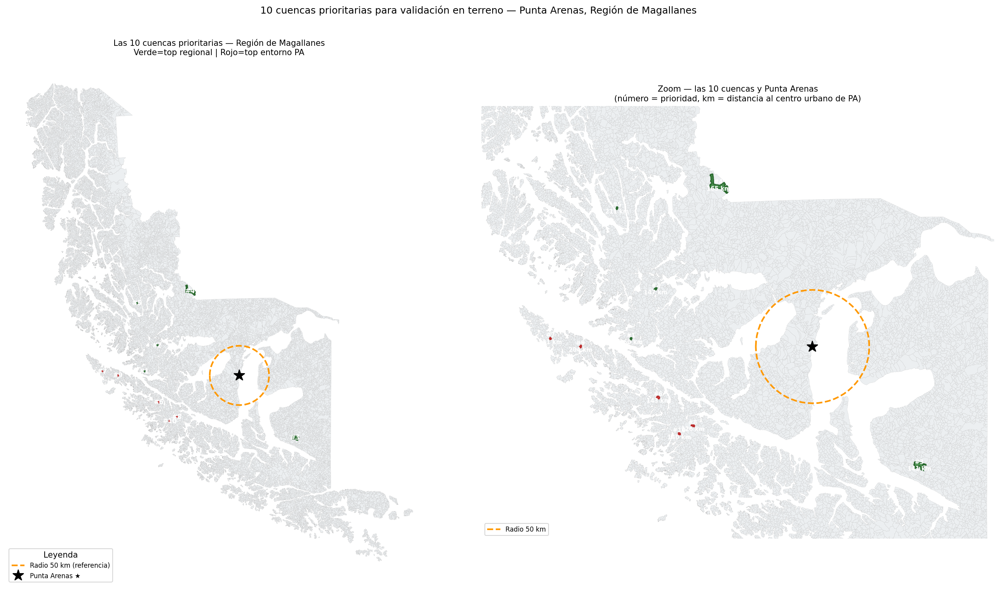

Este capítulo presenta una primera selección de cuencas candidatas para trabajo de terreno a partir del análisis de **jerk** de la Matriz de Resiliencia Climática Territorial. El objetivo no es cerrar una decisión definitiva de campaña, sino construir una lista técnicamente trazable de sitios que merecen revisión con mayor detalle, conversación con actores locales y evaluación logística.

El flujo de análisis procesó el panel MRCT 2013-2025, materializó una base analítica para consultas posteriores y generó mapas, rankings y series temporales para identificar cuencas con cambios abruptos en su trayectoria ecosistémica durante 2020-2025.

::: {.callout-note}
## Alcance de la selección

La lista de cuencas prioritarias es una **preselección técnica**. Antes de transformarla en itinerario de terreno debe revisarse con análisis espacial detallado, accesos reales, permisos, clima, seguridad, conocimiento local y reunión con personas o instituciones del territorio.
:::

## Pregunta de trabajo {#sec-pregunta-jerk-terreno}

La pregunta que orienta este análisis es:

> ¿Qué cuencas muestran cambios abruptos recientes en su trayectoria ecosistémica y cuáles de ellas pueden convertirse en candidatas razonables para observación, medición y validación en terreno?

La pregunta se separa en cuatro componentes:

- Identificar eventos abruptos medidos por jerk en la ventana 2020-2025;
- Distinguir entre intensificación y reversión de la trayectoria;
- Cruzar esos eventos con resiliencia, sensibilidad, contexto territorial y distancia a Punta Arenas;
- Producir una base consultable que permita ajustar la selección cuando se incorporen criterios logísticos o conocimiento local.

## Qué mide el jerk {#sec-criterio-jerk}

La MRCT calcula para cada cuenca y año una variable de dominio, `Domain` o $D$, que representa la distancia de la cuenca respecto de su estado ecosistémico de referencia. A partir de esa trayectoria se calculan derivadas temporales:

- $D$: distancia al régimen de referencia;
- $V$: velocidad de cambio de esa distancia;
- $A$: aceleración del cambio;
- $J$: cambio de la aceleración, o jerk.

En términos operativos, el jerk identifica una ruptura en la dinámica. Un valor alto en magnitud indica que la cuenca experimentó un salto abrupto en su trayectoria, aunque ese salto no debe interpretarse automáticamente como degradación, recuperación o causalidad comprobada.

El signo entrega una primera lectura:

| Tipo de evento | Condición | Lectura preliminar |
|---|---|---|
| Intensificación | $J > 0$ | Aceleración brusca del cambio respecto del dominio de referencia. Puede sugerir perturbación, presión o deterioro emergente. |
| Reversión | $J < 0$ | Frenada o inversión brusca de la trayectoria. Puede sugerir recuperación, estabilización, cambio de régimen o artefacto de datos. |

: Lectura básica del signo del jerk para selección de cuencas. {#tbl-signo-jerk}

Esta distinción es útil para terreno porque permite seleccionar casos con preguntas distintas. Una cuenca con intensificación puede requerir observar señales de presión reciente; una cuenca con reversión puede requerir revisar si existe recuperación visible, cambio hidrológico, variación de nieve, intervención local o inconsistencia en la serie satelital.

## Insumos analizados {#sec-insumos-jerk}

El análisis usó dos insumos principales:

| Insumo | Contenido | Uso en el análisis |
|---|---|---|
| `MRCT_v1.xlsx` | Panel MRCT completo, con 273.520 registros y 74 columnas. | Base temporal `RID × Year` para calcular eventos de jerk y cruzarlos con métricas MRCT. |
| `R12_cuencas_nema_v2.shp` | Geometría de 21.040 cuencas de Magallanes. | Base espacial para centroides, distancias, comunas y mapas. |

: Insumos principales del análisis de cuencas prioritarias por jerk. {#tbl-insumos-jerk}

El panel cubre 21.040 cuencas entre 2013 y 2025. Para el análisis de prioridad se trabajó con la ventana 2020-2025, porque representa la dinámica más reciente y porque el cálculo de jerk requiere años previos suficientes para estimar la tercera derivada discreta.

La geometría fue transformada al sistema EPSG:32719, que permite trabajar en coordenadas métricas para calcular distancias aproximadas desde Punta Arenas. El punto urbano de referencia se definió en torno a las coordenadas `-70,9171`, `-53,1638`, transformadas a UTM 19S.

## Estructura de datos para consulta posterior {#sec-estructura-datos-jerk}

Uno de los aportes centrales del análisis no es solo la tabla final, sino la estructura de datos que deja preparada para consultas futuras. El flujo convierte archivos pesados en formatos analíticos rápidos y materializa una base DuckDB local, reutilizable por código, herramientas SIG o aplicaciones web.

| Componente | Formato | Función |
|---|---|---|
| `mrct_panel.parquet` | Parquet | Copia eficiente del panel MRCT para relecturas rápidas. |
| `mrct_basins.parquet` | GeoParquet | Geometría de cuencas serializada con atributos espaciales. |
| `mrct_jerk_analysis.db` | DuckDB | Base analítica con tablas consultables sin reprocesar todos los insumos. |
| `cuencas_prioritarias_jerk_10.xlsx` | Excel | Tabla de salida con diez cuencas candidatas. |

: Productos de datos generados para consulta y reutilización. {#tbl-productos-datos-jerk}

La base DuckDB queda organizada en cinco tablas:

| Tabla | Contenido | Uso posterior |
|---|---|---|
| `mrct_panel` | Panel filtrado 2020-2025 con métricas MRCT por `RID` y `Year`. | Consultar trayectorias, resiliencia, dominio, velocidad, aceleración y jerk. |
| `basins` | Atributos y geometría de cuencas. | Construir mapas, cruces espaciales y visualizaciones. |
| `accessibility` | Centroide, distancia a Punta Arenas, comuna y anillo logístico. | Filtrar cuencas por factibilidad preliminar. |
| `jerk_events` | Eventos con jerk válido, percentiles y clasificación. | Identificar eventos extremos por año, comuna o tipo de evento. |
| `field_priority` | Ranking final de cuencas candidatas. | Alimentar reportes, fichas de terreno o aplicaciones de consulta. |

: Esquema de tablas creado para sostener consultas posteriores. {#tbl-esquema-duckdb-jerk}

Esta estructura permite que el análisis no dependa de una revisión manual de archivos intermedios. Una aplicación web, un tablero local, un script de actualización o un visor SIG podrían consultar la misma base para responder preguntas como: cuáles son las cuencas más extremas por año, cuáles están dentro de una comuna, cuáles tienen baja resiliencia, cuáles están cerca de un punto operativo o cuáles deben revisarse si cambia el umbral de prioridad.

## Control de calidad y cobertura {#sec-control-calidad-jerk}

Antes de priorizar cuencas se revisó la disponibilidad anual de jerk. Como esta métrica depende de derivadas temporales, los primeros años no tienen valores válidos. En la ventana de análisis reciente, la cobertura varía entre años.

| Año | Cuencas totales | Cuencas con jerk | Cobertura |
|---:|---:|---:|---:|
| 2020 | 21.040 | 6.921 | 32,9% |
| 2021 | 21.040 | 8.390 | 39,9% |
| 2022 | 21.040 | 4.936 | 23,5% |
| 2023 | 21.040 | 3.833 | 18,2% |
| 2024 | 21.040 | 3.692 | 17,5% |
| 2025 | 21.040 | 3.770 | 17,9% |

: Disponibilidad de jerk en la ventana 2020-2025. {#tbl-disponibilidad-jerk}

La cobertura confirma que el análisis debe interpretarse con cautela. La ausencia de jerk válido en una cuenca no implica estabilidad ecosistémica; puede reflejar falta de datos suficientes, calidad de observación, restricciones de cálculo o problemas de disponibilidad en los insumos anuales.

También se identificaron casos extremos para revisión. Los diez mayores valores absolutos de jerk incluyen eventos en Natales, Punta Arenas y otras comunas, con magnitudes entre 15,21 y 18,19. Estos casos no se eliminaron automáticamente: se conservaron como señales relevantes que deben revisarse con imágenes, series temporales y terreno.

{#fig-outliers-jerk fig-align="center" width="90%"}

## Eventos de jerk {#sec-eventos-jerk}

El análisis materializó **31.542 eventos** con jerk válido en 2020-2025. Para cada evento se calcularon dos percentiles:

- percentil anual, que compara una cuenca con otras cuencas del mismo año;
- percentil global, que compara el evento con todos los eventos de la ventana 2020-2025.

El uso de percentiles evita interpretar el valor bruto de jerk fuera de contexto. Un mismo valor puede ser extremo en un año y moderado en otro. Por eso el ranking usa percentiles y no solo magnitudes absolutas.

La distribución de clases en 2020-2025 muestra una gran cantidad de eventos neutros y una presencia balanceada de intensificaciones y reversiones fuertes:

| Clase de jerk | Eventos |
|---|---:|
| Neutro | 101.986 |
| Reversión leve | 6.280 |
| Intensificación leve | 6.239 |
| Reversión fuerte | 5.945 |
| Intensificación fuerte | 5.790 |

: Distribución de clases de jerk en la ventana 2020-2025. {#tbl-clases-jerk}

{#fig-distribucion-jerk-anual fig-align="center" width="95%"}

Los eventos regionales más extremos se concentran principalmente en Natales y Punta Arenas. Destacan, por ejemplo, el `RID 12614` en 2024 con reversión fuerte, el `RID 16141` en 2025 con intensificación fuerte, y el `RID 963` en Punta Arenas en 2023 con intensificación fuerte.

| RID | Año | Jerk | Tipo | Percentil anual | `RES` | Comuna |
|---:|---:|---:|---|---:|---:|---|
| 12614 | 2024 | -18,1910 | Reversión fuerte | 100,0 | 0,00042 | Natales |
| 16666 | 2024 | -17,5785 | Reversión fuerte | 100,0 | 0,00047 | Natales |
| 16141 | 2025 | 17,4068 | Intensificación fuerte | 100,0 | 0,00022 | Natales |
| 12614 | 2025 | 16,1410 | Intensificación fuerte | 100,0 | 0,00043 | Natales |
| 12521 | 2024 | 15,8616 | Intensificación fuerte | 99,9 | 0,00218 | Natales |
| 963 | 2023 | 15,6354 | Intensificación fuerte | 100,0 | 0,10950 | Punta Arenas |
| 19883 | 2021 | -15,4961 | Reversión fuerte | 100,0 | 0,00015 | Natales |
| 16666 | 2025 | 15,4425 | Intensificación fuerte | 99,9 | 0,00161 | Natales |
| 43 | 2024 | -15,3694 | Reversión fuerte | 99,9 | 0,00130 | Punta Arenas |
| 19411 | 2024 | -15,2141 | Reversión fuerte | 99,9 | 0,00891 | Natales |

: Diez eventos regionales de mayor magnitud absoluta de jerk. {#tbl-top-eventos-jerk}

## Cruce territorial y accesibilidad preliminar {#sec-cruce-territorial-jerk}

El análisis incorporó una primera lectura logística desde Punta Arenas. Esta lectura no reemplaza la revisión de caminos, permisos o tiempos reales de traslado; solo entrega una aproximación inicial basada en centroides, comuna y distancia euclidiana.

Se usaron tres anillos:

| Anillo | Criterio de distancia | Lectura logística preliminar |
|---|---|---|
| Cercano | 0-30 km | Potencial visita corta si existe acceso real. |
| Intermedio | 30-80 km | Visita de media jornada o jornada completa. |
| Extendido | Más de 80 km | Requiere mayor justificación técnica y planificación. |

: Anillos de accesibilidad preliminar usados en el análisis. {#tbl-anillos-jerk}

El diagnóstico territorial identificó **186 candidatas** en el entorno ampliado de Punta Arenas bajo un umbral de jerk igual o superior al percentil 90. Sin embargo, el resultado muestra una advertencia importante: el territorio comunal de Punta Arenas es muy extenso, por lo que varias cuencas de la comuna están a más de 100 km del centro urbano.

En el buffer operativo exploratorio de 50 km y umbral p90 se identificaron 130 cuencas calificadas. Aun así, al combinar prioridad regional y prioridad comunal, las diez cuencas seleccionadas quedaron en anillo extendido. Esto obliga a que la fase siguiente revise rutas reales y factibilidad con mayor detalle.

{#fig-buffer-jerk fig-align="center" width="100%"}

## Puntaje de priorización {#sec-puntaje-jerk}

Para pasar desde eventos individuales a cuencas candidatas se construyó un puntaje compuesto, denominado `P_score`. Este puntaje combina dimensiones técnicas y logísticas:

| Dimensión | Peso | Qué representa |
|---|---:|---|
| Magnitud de jerk | 0,35 | Intensidad relativa del evento abrupto. |
| Resiliencia | 0,20 | Prioridad asociada a bajo `RES` o condición crítica. |
| Relevancia ecosistémica | 0,15 | Relación con estado, tipo de resiliencia y señal territorial. |
| Sensibilidad o contexto | 0,15 | Relación con sensibilidad y contraste local cuando existe información. |
| Accesibilidad preliminar | 0,15 | Distancia y pertenencia al entorno operativo definido. |

: Componentes del puntaje compuesto de prioridad. {#tbl-pesos-prioridad-jerk}

Los pesos son una decisión inicial de trabajo. Deben quedar como parámetros ajustables, especialmente después de revisar logística, rutas, permisos y conocimiento local. En esta etapa el puntaje cumple una función práctica: ordenar las candidatas, no demostrar que una cuenca sea objetivamente más importante que otra en todos los sentidos.

El ranking regional produjo **1.806 cuencas candidatas únicas**, usando un evento representativo por cuenca. El rango de `P_score` fue de 0,074 a 0,953. Las primeras posiciones regionales se concentran en Río Verde, Timaukel, Natales y Punta Arenas.

## Diez cuencas candidatas {#sec-diez-cuencas-jerk}

La tabla siguiente presenta las diez cuencas priorizadas por el flujo de análisis. La selección combinó las cinco mejores candidatas regionales y las mejores candidatas asociadas al entorno/comuna de Punta Arenas para mantener una mezcla entre señal regional fuerte y relevancia logística para la campaña.

| Prioridad | RID | Comuna | Año crítico | Jerk | Percentil anual | Tipo de evento | `RES` año crítico | Distancia a PA (km) | Anillo | `P_score` |
|---:|---:|---|---:|---:|---:|---|---:|---:|---|---:|
| 1 | 3555 | Río Verde | 2021 | 7,8550 | 99,9 | Intensificación | 0,00010 | 160,1 | Extendido | 0,9527 |
| 2 | 4203 | Río Verde | 2023 | 5,4293 | 98,7 | Intensificación | 0,00000 | 147,3 | Extendido | 0,9300 |
| 3 | 10929 | Timaukel | 2022 | -7,7200 | 99,8 | Reversión | 0,00061 | 140,8 | Extendido | 0,9142 |
| 4 | 13206 | Natales | 2023 | 8,2457 | 99,7 | Intensificación | 0,00007 | 164,7 | Extendido | 0,9136 |
| 5 | 12754 | Natales | 2020 | 5,3564 | 99,4 | Intensificación | 0,00037 | 211,2 | Extendido | 0,9125 |
| 6 | 1340 | Punta Arenas | 2020 | -4,8846 | 99,2 | Reversión | 0,00044 | 143,3 | Extendido | 0,9060 |
| 7 | 275 | Punta Arenas | 2020 | 6,4628 | 99,8 | Intensificación | 0,00205 | 231,1 | Extendido | 0,8699 |
| 8 | 461 | Punta Arenas | 2021 | 3,9040 | 98,7 | Intensificación | 0,00037 | 126,5 | Extendido | 0,8595 |
| 9 | 43 | Punta Arenas | 2024 | -15,3694 | 99,9 | Reversión | 0,00130 | 204,5 | Extendido | 0,8549 |
| 10 | 446 | Punta Arenas | 2020 | -4,0726 | 98,6 | Reversión | 0,00259 | 140,4 | Extendido | 0,8442 |

: Diez cuencas candidatas para validación en terreno según análisis de jerk. {#tbl-diez-cuencas-prioritarias}

La tabla debe leerse como un punto de partida. Todas las cuencas seleccionadas aparecen en anillo extendido, lo que significa que la factibilidad real no está resuelta. Antes de ejecutar una campaña se debe verificar acceso por caminos, tiempos de traslado, permisos, condiciones climáticas, seguridad y disponibilidad de puntos de observación.

{#fig-cuencas-buffer-jerk fig-align="center" width="100%"}

{#fig-eventos-regionales-jerk fig-align="center" width="90%"}

{#fig-top10-jerk fig-align="center" width="100%"}

## Lectura de series temporales {#sec-series-temporales-jerk}

Para las tres cuencas de mayor puntaje se revisaron series temporales completas 2013-2025 de `Domain`, `Velocidad`, `Aceleracion`, `Jerk` y `RES`. Esta lectura es necesaria porque un ranking por jerk puede seleccionar picos aislados. La serie permite distinguir si el evento abrupto aparece como una ruptura puntual, una intensificación dentro de una tendencia o una reversión después de varios años de alejamiento del dominio.

{#fig-series-top3-jerk fig-align="center" width="100%"}

Esta lectura debe repetirse para cualquier cuenca que pase a planificación de terreno. Una cuenca no debería visitarse solo porque aparece en el top 10; debería visitarse porque su serie temporal formula una pregunta territorial clara.

## Cómo usar esta selección en la planificación de terreno {#sec-uso-terreno-jerk}

La selección por jerk debe alimentar una reunión técnica y territorial antes de definir rutas. En esa revisión se recomienda trabajar con tres listas:

- **lista prioritaria**, con las diez cuencas del ranking técnico;
- **lista logística**, con cuencas cercanas, accesibles o visitables en el mismo recorrido;
- **lista de reemplazo**, con cuencas alternativas por si falla el acceso, el clima o el permiso.

La reunión debe revisar, al menos:

- caminos, huellas, portones, predios y accesos reales;
- restricciones de propiedad, áreas protegidas o infraestructura;
- posibilidad de vuelo de dron según viento, visibilidad y normativa;
- disponibilidad de puntos seguros para medición;
- pertinencia territorial de visitar Río Verde, Timaukel, Natales o Punta Arenas según recursos disponibles;
- conocimiento local sobre eventos recientes: incendios, inundaciones, sequías, obras, cambios de uso, ganadería, extracción, cortes de camino o nieve persistente;
- conveniencia de incorporar cuencas de control con menor señal MRCT.

El producto esperado de esa reunión no es reemplazar el ranking, sino convertirlo en un plan de campaña realista: qué cuencas se visitan, cuáles quedan como respaldo, qué hipótesis se validan y qué observaciones se necesitan en cada sitio.

## Fichas de terreno derivadas {#sec-fichas-jerk}

Cada cuenca que avance a terreno debe tener una ficha técnica. La base generada permite poblar automáticamente buena parte de esa ficha.

| Bloque de ficha | Campos sugeridos |
|---|---|
| Identificación | `RID`, comuna, prioridad, año crítico, tipo de evento. |
| Señal MRCT | `Jerk`, percentil anual, `RES`, `RES_STATE`, `RES_TYPE`, `Domain`, `Velocidad`, `Aceleracion`, `SENS`, `Domain_local`. |
| Ubicación | centroide, distancia a Punta Arenas, anillo, mapa de detalle, ruta preliminar. |
| Pregunta de terreno | Qué condición debería observarse según la señal: intensificación, reversión, baja resiliencia o contraste local. |
| Observaciones requeridas | fotografías, dron, temperatura, humedad, agua visible, nieve, cobertura, perturbación, accesibilidad. |
| Estado de validación | consistente, parcialmente consistente, no consistente o no evaluable. |

: Contenido sugerido para fichas de terreno derivadas del ranking de jerk. {#tbl-ficha-jerk}

Estas fichas son el puente entre análisis y campaña. Evitan que el equipo de terreno reciba solo coordenadas y permiten que cada visita tenga una pregunta de validación explícita.

## Limitaciones {#sec-limitaciones-jerk}

El análisis tiene limitaciones que deben mantenerse visibles:

- el jerk detecta discontinuidades, no causas;
- un evento extremo puede deberse a cambio ecológico real, ruido, nube, nieve, mosaico débil, cambio de cobertura temporal o efecto metodológico;
- la distancia a Punta Arenas se calculó como aproximación euclidiana, no como tiempo real de viaje;
- pertenecer a la comuna de Punta Arenas no implica cercanía al centro urbano;
- las cuencas seleccionadas están en anillo extendido, por lo que la logística puede ser más exigente de lo que sugiere una lectura comunal;
- la selección no incorpora todavía permisos, propiedad, estado de caminos, conocimiento local ni seguridad de vuelo;
- las coberturas de jerk en 2023-2025 son menores que en 2020-2021, lo que obliga a revisar disponibilidad y calidad de datos.

Estas limitaciones no invalidan el análisis. Definen su uso correcto: una herramienta para orientar dónde mirar primero y qué preguntas llevar a terreno.

## Cierre operativo {#sec-cierre-jerk}

La selección de cuencas por jerk convierte el panel MRCT en una agenda preliminar de validación territorial. El procesamiento identificó eventos abruptos recientes, construyó una base consultable, produjo mapas y generó una lista de diez cuencas candidatas.

El siguiente paso no es salir directamente a esas diez cuencas, sino someter la lista a una revisión aplicada: análisis detallado de accesibilidad, reunión con personas locales, evaluación de rutas, permisos, clima, seguridad y pertinencia territorial. Con esa revisión, el ranking puede transformarse en un plan de terreno con sitios principales, sitios alternativos y preguntas de validación claras.
