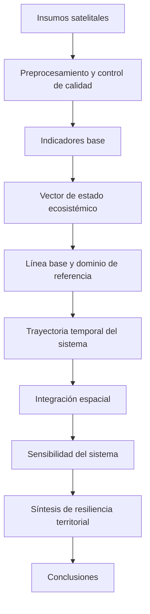
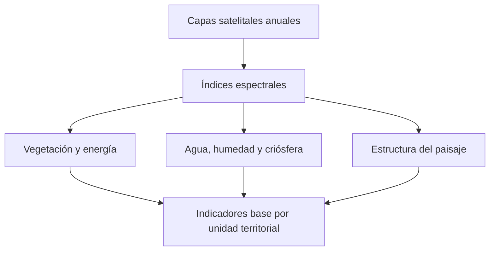
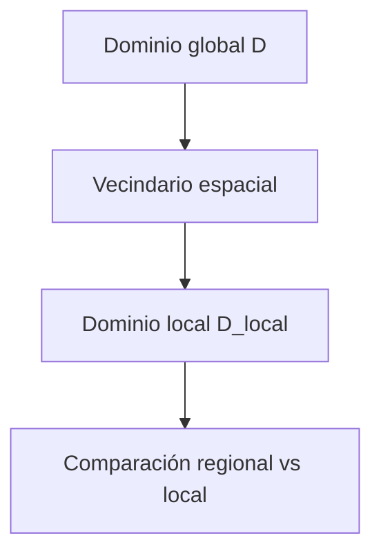
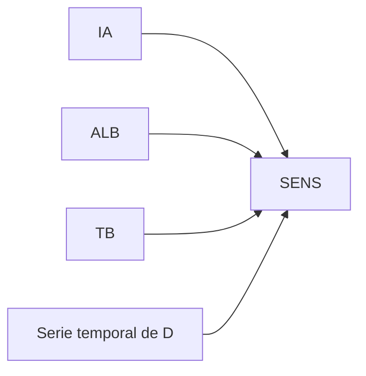
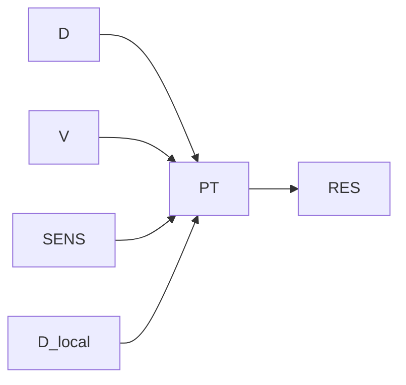

# Libro digital técnico de la MRCT

## Propósito

Este documento organiza la redacción de un libro digital técnico sobre la Matriz de Resiliencia Climática Territorial (MRCT).

La meta es explicar el modelo con claridad. Cada capítulo debe responder cuatro preguntas: qué entra, qué se calcula, qué sale y cómo se interpreta.

El tono debe ser técnico, directo y legible. Se deben evitar repeticiones, metáforas extensas y explicaciones circulares. Cuando una analogía ayude a entender mejor, debe ser breve y funcional.

El libro debe leerse como una secuencia lógica. Primero se presentan los insumos. Luego se derivan los indicadores base. Después se construye el estado ecosistémico, se mide su trayectoria, se incorpora el espacio, se estima la sensibilidad y se sintetiza la resiliencia territorial.

---

## Principios de escritura

### Una idea por párrafo
Cada párrafo debe desarrollar una sola idea.

### Definición antes que interpretación
Primero se define la variable o proceso. Después se explica el cálculo. Al final se interpreta.

### Resultados al cierre de cada capítulo
Cada capítulo debe terminar con los productos que lo validan: tablas, mapas, series, distribuciones o métricas.

### Transiciones suaves
Cada capítulo debe comenzar conectando con el anterior. La progresión del libro debe sentirse continua.

### Fórmulas como parte del texto técnico
Las ecuaciones deben aparecer solo cuando ayudan a precisar el cálculo. No deben recargar la lectura.

---

## Estructura general del libro

1. Introducción
2. Objetivos
3. Insumos satelitales
4. Indicadores base
5. Vector de estado ecosistémico y línea base
6. Trayectoria del estado sistémico
7. Integración espacial
8. Sensibilidad del sistema
9. Síntesis de resiliencia territorial
10. Conclusiones

---

## Flujo general del modelo



---

# 1. Introducción

La MRCT es un sistema para describir cómo cambian las unidades territoriales en el tiempo a partir de señales satelitales e indicadores derivados.

La idea central es simple. Un territorio no se interpreta como una imagen aislada, sino como una trayectoria dentro de un espacio de estados. Por eso el modelo no solo pregunta qué cambió, sino también cuánto se alejó, con qué velocidad y en qué contexto.

Una analogía útil es la de una ruta. Los indicadores base describen la posición del sistema. La línea base fija el punto de referencia. La trayectoria muestra si la cuenca se mantiene cerca, se aleja o comienza a reorganizarse.

Este capítulo debe explicar el problema que aborda la MRCT, la lógica del enfoque y la estructura general del libro.

## Contenido mínimo

- problema de análisis territorial que aborda la MRCT;
- límites del monitoreo basado solo en mapas o indicadores aislados;
- idea de estado ecosistémico;
- lógica multivariada, temporal y espacial del modelo;
- estructura general del libro.

## Resultados a incorporar

- esquema general del sistema;
- diagrama simple del flujo completo;
- figura que conecte insumos, indicadores y resiliencia.

---

# 2. Objetivos

Este capítulo debe fijar el propósito del libro y del modelo de forma breve y verificable.

El objetivo general debe describir la construcción de una matriz capaz de representar el estado ecosistémico, su trayectoria, su contexto espacial y su síntesis de resiliencia.

Los objetivos específicos deben corresponder a las etapas reales del flujo metodológico. Cada uno debe asociarse a un producto concreto.

## Propuesta de objetivo general

Construir una matriz de resiliencia climática territorial que represente el estado ecosistémico de cada unidad territorial, su evolución temporal, su coherencia espacial y su propensión a transición, usando señales satelitales e indicadores derivados.

## Propuesta de objetivos específicos

- Derivar indicadores base a partir de mosaicos satelitales anuales.
- Integrar los indicadores en un vector de estado ecosistémico por unidad territorial y año.
- Definir una línea base o dominio de referencia.
- Medir la trayectoria temporal del sistema con derivadas discretas.
- Incorporar la dimensión espacial mediante dominio local.
- Estimar la sensibilidad del sistema frente a presiones persistentes.
- Sintetizar la información en métricas de transición y resiliencia territorial.

## Resultados a incorporar

- tabla de objetivos y productos esperados;
- diagrama que conecte cada objetivo con una etapa del flujo.

---

# 3. Insumos satelitales

Una vez definido el propósito del modelo, el siguiente paso es dejar claro con qué datos trabaja.

La lógica aquí debe ser directa. Cada mosaico satelital es una medición física de la superficie. El modelo parte de esa señal y luego la transforma en indicadores interpretables.

Este capítulo debe explicar la fuente de datos, las variables espectrales disponibles, el criterio temporal y espacial, y el preprocesamiento necesario para asegurar comparabilidad.

## 3.1 Fuente de datos

Describir el sensor o sensores utilizados, el período temporal cubierto, la resolución espacial y la cobertura territorial.

## 3.2 Variables de entrada

El flujo anual trabaja con seis capas principales:

- NDVI
- NDWI
- NDSI
- NDDI
- ALB
- TB

## 3.3 Control de calidad

Primero se limpia la señal. Después se calcula. Esa es la regla del capítulo.

Aquí se debe explicar el filtrado aplicado antes de generar indicadores: nubes, sombras, valores anómalos y control físico mínimo de las capas.

## 3.4 Alineamiento espacial

Todos los rasters deben compartir la misma grilla espacial. Esa grilla se define con la unidad territorial de referencia. Este punto es clave, porque toda agregación posterior depende de que cada píxel ocupe la posición correcta.

## Diagrama de flujo del preprocesamiento


## Resultados a incorporar

- tabla de insumos satelitales;
- esquema de capas disponibles por año;
- resumen del control de calidad;
- visualización de mosaicos de ejemplo.

---

# 4. Indicadores base

Este capítulo debe presentar el primer nivel de resultados del modelo. Su función es convertir señales satelitales en métricas interpretables por unidad territorial.

Conviene organizarlo por grupos. Esa estructura reduce ruido y mantiene una progresión clara.

Cada indicador debe seguir la misma ficha mínima:

- definición breve;
- fórmula utilizada;
- insumos requeridos;
- procesamiento;
- interpretación;
- resultados a mostrar.

## Diagrama general de indicadores base



## 4.1 Vegetación y energía

### VEG

VEG representa la fracción de vegetación activa dentro de la unidad territorial.

La fórmula utilizada combina NDVI y un umbral de vegetación activa:

```math
NDVI = (\rho_{NIR} - \rho_{Red}) / (\rho_{NIR} + \rho_{Red})
```

```math
VEG = \frac{\sum_{p \in C} \mathbb{1}[NDVI_p \geq \theta_{veg}]}{|C|}
```

Aquí, \(C\) es el conjunto de píxeles válidos de la cuenca y \(\theta_{veg}\) es el umbral utilizado.

El procesamiento consiste en calcular NDVI, aplicar el umbral y obtener la proporción de píxeles vegetados por unidad territorial.

La interpretación es directa. Valores altos indican mayor presencia de vegetación activa.

**Resultados a incorporar:** mapa anual, histograma y tabla resumen.

### IRV

IRV representa el vigor relativo de la vegetación. Complementa a VEG porque no solo mide presencia, sino intensidad del estado vegetacional.

**Fórmula utilizada:** incorporar la ecuación exacta aplicada en el modelo.

**Procesamiento:** resumir el vigor relativo a escala de unidad territorial.

**Interpretación:** valores altos indican mayor intensidad vegetacional relativa.

**Resultados a incorporar:** distribución, mapa y comparación temporal.

### ALB

ALB representa el albedo superficial medio.

El albedo resume cuánta radiación refleja la superficie. En términos simples, superficies más claras reflejan más y superficies más oscuras reflejan menos.

**Fórmula utilizada:** incorporar la definición exacta aplicada.

**Procesamiento:** usar la capa anual de albedo y agregarla por unidad territorial.

**Interpretación:** valores altos pueden asociarse a suelos expuestos, nieve u otras cubiertas reflectantes.

**Resultados a incorporar:** mapa, distribución y percentiles.

### TB

TB representa la temperatura de brillo media.

Es la señal térmica superficial agregada por unidad territorial.

**Fórmula utilizada:** incorporar la definición exacta aplicada.

**Procesamiento:** usar la capa térmica anual y resumirla por unidad territorial.

**Interpretación:** valores altos indican mayor carga térmica relativa.

**Resultados a incorporar:** mapa, serie temporal y comparación regional.

### IA

IA representa aridificación o presión seca relativa.

Se construye a partir de NDDI y además se utiliza como parte del componente de sensibilidad del sistema.

**Fórmula utilizada:** incorporar la ecuación exacta aplicada.

**Procesamiento:** calcular o cargar NDDI anual y agregarlo por unidad territorial.

**Interpretación:** valores altos indican condiciones más secas o mayor tensión hídrica.

**Resultados a incorporar:** mapa, evolución temporal y contraste con vegetación.

## 4.2 Agua, humedad y criósfera

### NDWI

NDWI es el índice base del componente hídrico.

La fórmula utilizada es:

```math
NDWI = (\rho_{Green} - \rho_{NIR}) / (\rho_{Green} + \rho_{NIR})
```

**Procesamiento:** cálculo raster anual y agregación territorial.

**Interpretación:** valores altos reflejan mayor presencia relativa de agua o humedad superficial.

### WA

WA representa la fracción de agua superficial por unidad territorial.

La forma general utilizada es:

```math
WA = \frac{|\{p: NDWI \geq \theta_w\}|}{|C|}
```

**Procesamiento:** aplicar el umbral de agua sobre NDWI y calcular la fracción por unidad territorial.

**Interpretación:** valores altos indican mayor presencia de agua superficial.

### HUM

HUM representa fracción de humedales o zona de transición hídrica.

Se define usando un rango intermedio de NDWI entre un umbral húmedo y el umbral de agua abierta.

**Procesamiento:** clasificar píxeles intermedios y calcular la proporción por unidad territorial.

**Interpretación:** valores altos sugieren mayor presencia de humedales o superficies saturadas.

### IEH

IEH mide heterogeneidad hídrica.

Se define como la desviación estándar de NDWI en el subconjunto de píxeles hídricos:

```math
IEH = std(NDWI_{p: NDWI \geq \theta_w})
```

Una analogía útil es pensar IEH como dispersión interna del agua. Una cuenca con agua concentrada en un solo cuerpo grande tiende a tener menor heterogeneidad que una cuenca con múltiples expresiones hídricas distribuidas.

**Resultados a incorporar:** mapa, distribución y ejemplos contrastados.

### NDSI

NDSI es el índice base del componente nival.

La fórmula utilizada es:

```math
NDSI = (\rho_{Green} - \rho_{SWIR}) / (\rho_{Green} + \rho_{SWIR})
```

**Procesamiento:** cálculo raster anual.

**Interpretación:** valores altos indican mayor señal de nieve o hielo.

### PN

PN representa persistencia o fracción nival por unidad territorial.

Su cálculo sigue la forma:

```math
PN = \frac{|\{p: NDSI \geq \theta_{snow}\}|}{|C|}
```

**Procesamiento:** aplicar el umbral nival y agregar por unidad territorial.

**Interpretación:** valores altos indican mayor presencia relativa de nieve.

## 4.3 Estructura del paisaje

Estas métricas describen el patrón espacial interno de la vegetación. No solo indican cuánto hay, sino cómo está organizada.

### NP

NP es el número de parches de vegetación.

**Procesamiento:** etiquetado de componentes conectadas.

**Interpretación:** más parches suele indicar mayor fragmentación.

### MPA

MPA es el tamaño medio de parche.

**Procesamiento:** calcular el área de cada parche y promediar por unidad territorial.

**Interpretación:** valores bajos sugieren una estructura más fragmentada.

### LPI

LPI es la proporción del área que concentra el parche dominante.

**Procesamiento:** identificar el parche mayor y expresar su peso relativo.

**Interpretación:** valores altos indican dominancia espacial de una estructura principal.

### CONNECTIVITY

CONNECTIVITY es un proxy de continuidad ecológica.

La expresión utilizada es:

```math
CONNECTIVITY = VEG \cdot \sqrt{MPA / VEG_{pix}}
```

**Procesamiento:** combinar cobertura vegetal y tamaño medio de parche.

**Interpretación:** valores altos sugieren mayor continuidad entre parches.

## Resultados a incorporar en este capítulo

- ficha técnica por indicador;
- fórmula utilizada;
- insumos necesarios;
- mapa por indicador;
- distribución estadística;
- ejemplo breve de interpretación.

---

# 5. Vector de estado ecosistémico y línea base

Una vez construidos los indicadores base, se integran en un solo vector por unidad territorial y año.

Esta es la forma más simple de entender el estado ecosistémico: un conjunto ordenado de variables que describe la condición del territorio en un momento específico.

La integración puede presentarse primero como un hipercubo de datos y luego como un panel largo unidad territorial × año. Esa transición debe explicarse de forma simple.

## 5.1 Hipercubo y panel

La estructura general se describe como:

```math
T \in \mathbb{R}^{N_{unidades} \times N_{años} \times d}
```

Luego se transforma a una tabla larga con una fila por unidad territorial y año.

## 5.2 Línea base

La línea base define el estado de referencia del sistema.

No es un valor ideal. Es el régimen respecto del cual se medirá la distancia posterior.

La línea base debe describirse con precisión: período usado, criterio de selección y rol analítico.

## 5.3 Dominio de referencia

El dominio se construye con variables estructurales seleccionadas, normalización robusta y una matriz de covarianza regularizada.

La intuición aquí es sencilla. Si el vector de estado es la posición de la cuenca, el dominio es la región donde esa posición todavía se considera consistente con su referencia histórica.

## Diagrama del vector de estado y baseline


## Resultados a incorporar

- tabla del vector de estado;
- variables incluidas en el dominio;
- resumen del período baseline;
- visualización del panel temporal;
- figura del dominio de referencia.

---

# 6. Trayectoria del estado sistémico

Con el dominio definido, el modelo puede medir trayectoria.

La idea aquí es natural. No basta con saber dónde está una cuenca. También importa saber si se está alejando, frenando o cambiando de régimen.

Esta etapa se resuelve con derivadas discretas de D.

## 6.1 Distancia al dominio

La distancia al dominio se calcula con Mahalanobis sobre el vector normalizado.

La distancia expresa cuánto se aleja la unidad territorial de su referencia estructural.

## 6.2 Derivadas temporales

Se trabaja con tres derivadas:

```math
V = \Delta D / \Delta t
```

```math
A = \Delta V / \Delta t
```

```math
Jerk = \Delta A / \Delta t
```

Cada una responde a una pregunta distinta:

- Velocidad: si el sistema se aleja o se recupera.
- Aceleración: si el cambio se intensifica o se amortigua.
- Jerk: si aparece una señal más brusca de reorganización.

## Diagrama de trayectoria temporal


## Resultados a incorporar

- series temporales por unidad territorial;
- distribución anual de D;
- gráficos de V, A y Jerk;
- tipologías temporales de ejemplo.

---

# 7. Integración espacial

Hasta aquí el análisis es temporal. El siguiente paso es incorporar contexto espacial.

La idea es simple. Una unidad territorial no existe aislada. Puede estar estable en términos globales, pero ser anómala frente a sus vecinas. O al revés.

Esta etapa se resuelve mediante un dominio local basado en vecinos cercanos.

## 7.1 Dominio local

La forma general utilizada es:

```math
D_{local,i} = \frac{\sum_{j \in N_k(i)} w_{ij} \cdot D_j}{\sum_{j \in N_k(i)} w_{ij}}
```

Aquí, \(N_k(i)\) representa las unidades vecinas y \(w_{ij}\) sus pesos espaciales.

## 7.2 Interpretación

El dominio global mide distancia respecto al régimen general de referencia.

El dominio local mide coherencia respecto al entorno inmediato.

La combinación de ambos permite distinguir problemas regionales de anomalías locales.

## Diagrama de integración espacial



## Resultados a incorporar

- mapa de dominio local;
- explicación del criterio de vecindad;
- casos de contraste entre dominio global y local;
- figuras de vecindario espacial.

---

# 8. Sensibilidad del sistema

Después de incorporar el espacio, el siguiente paso es medir sensibilidad.

La sensibilidad cuantifica cuánto responde el estado de una unidad territorial a forzantes persistentes. En este modelo, esos forzantes son IA, ALB y TB.

## 8.1 Modelo de sensibilidad

El esquema utilizado es una regresión lineal múltiple por unidad territorial:

```math
D_t = \beta_0 + \beta_1 IA_t + \beta_2 ALB_t + \beta_3 TB_t + \epsilon_t
```

La sensibilidad se resume como:

```math
SENS = ||\beta_{1:3}|| / \sigma_D
```

## 8.2 Interpretación

Una unidad con alta sensibilidad reacciona más ante cambios de aridez, energía superficial o temperatura.

Una analogía útil es la de un sistema más o menos sensible al empuje externo. Dos unidades pueden tener el mismo estado actual, pero distinta capacidad de amortiguación frente a un mismo forzante.

## Diagrama de sensibilidad



## Resultados a incorporar

- distribución de SENS;
- mapas regionales de sensibilidad;
- ejemplos de unidades contrastantes;
- gráficos entre D y forzantes climáticos.

---

# 9. Síntesis de resiliencia territorial

Este capítulo integra todo lo anterior.

El objetivo es producir una medida sintética que combine distancia, dinámica, sensibilidad y contexto espacial.

## 9.1 Potencial de transición

La fórmula utilizada para el potencial de transición es:

```math
PT = D \cdot (1 + |V|) \cdot (1 + \alpha \cdot SENS) \cdot (1 + \beta_{local} \cdot D_{local})
```

Cada componente cumple una función clara:

- D: distancia estructural al baseline.
- |V|: intensidad del cambio.
- SENS: amplificación por sensibilidad climática.
- D_local: presión o coherencia del contexto espacial.

## 9.2 Resiliencia operativa

La resiliencia operativa debe presentarse como una transformación monotónica de PT en una escala interpretable.

Su lectura es simple. PT representa propensión a transición. RES representa la lectura inversa en clave de resiliencia operativa.

La fórmula exacta utilizada debe indicarse aquí.

## 9.3 Lectura integrada

Este es el punto donde el libro debe mostrar con claridad qué entrega el modelo.

La MRCT no solo indica qué cambió. También permite responder:

- cuánto se alejó el sistema;
- con qué rapidez cambia;
- si el cambio se intensifica;
- si el entorno espacial acompaña o amortigua;
- cuánta sensibilidad muestra frente a forzantes persistentes.

## Diagrama de síntesis



## Resultados a incorporar

- mapa de PT;
- mapa de RES;
- tabla de unidades con mayor y menor resiliencia;
- comparación entre componentes;
- ejemplos narrativos de interpretación integrada.

---

# 10. Conclusiones

El capítulo final debe cerrar el libro con precisión.

No debe repetir todo el contenido anterior. Debe resumir qué construye la MRCT, qué aporta metodológicamente y cómo deben leerse sus resultados.

También debe diferenciar con claridad entre lo que el modelo mide de forma directa y lo que solo puede sugerir o apoyar como interpretación.

## Puntos de cierre recomendados

- La MRCT organiza señales satelitales en un sistema de lectura territorial multivariado.
- Los indicadores base son la capa descriptiva del modelo.
- El vector de estado y la línea base permiten construir una referencia coherente.
- La trayectoria temporal agrega ritmo y dirección.
- La integración espacial agrega contexto.
- La sensibilidad agrega respuesta a forzantes persistentes.
- La síntesis final traduce todo lo anterior en métricas operativas de resiliencia territorial.

## Resultados a incorporar

- esquema final del sistema completo;
- tabla resumen de productos por capítulo;
- recomendaciones de lectura e interpretación;
- conexión con posibles aplicaciones territoriales.

---

## Tabla de integración entre capítulos y productos

| Capítulo | Producto principal | Contenido a integrar |
|---|---|---|
| Introducción | Esquema general del modelo | problema, enfoque, flujo general |
| Objetivos | Tabla de objetivos y productos | objetivos y correspondencia metodológica |
| Insumos satelitales | Tabla de capas y QA | fuentes, capas y control de calidad |
| Indicadores base | Fórmulas, mapas y distribuciones | definición, cálculo e interpretación |
| Vector de estado y línea base | Panel, baseline y dominio | integración multivariada y referencia |
| Trayectoria del estado sistémico | D, V, A y Jerk | distancia y dinámica temporal |
| Integración espacial | D_local y mapas | vecindad y coherencia espacial |
| Sensibilidad del sistema | SENS y relaciones con forzantes | respuesta a presiones persistentes |
| Síntesis de resiliencia territorial | PT, RES, tablas y mapas | síntesis de transición y resiliencia |
| Conclusiones | Síntesis metodológica y operativa | cierre e interpretación final |

---

## Uso recomendado de fórmulas, parámetros y resultados dentro del libro

El libro debe utilizar cuatro tipos de insumos metodológicos ya definidos en el proyecto:

1. Fórmulas: incorporar las ecuaciones efectivamente utilizadas.
2. Procesamiento: explicar con claridad cómo se calcula cada variable o etapa.
3. Resultados: integrar mapas, series, histogramas y tablas en cada capítulo.
4. Parámetros: documentar umbrales, baseline y pesos usados en las métricas sintéticas.

---

## Próximo paso editorial recomendado

Antes de escribir el libro completo, conviene preparar una matriz de trabajo por capítulo con estas columnas:

- capítulo,
- variable o proceso central,
- fórmula,
- gráfico requerido,
- tabla requerida,
- interpretación esperada.

Esa matriz permitirá llenar el libro de forma ordenada y evitar que queden capítulos desbalanceados.

