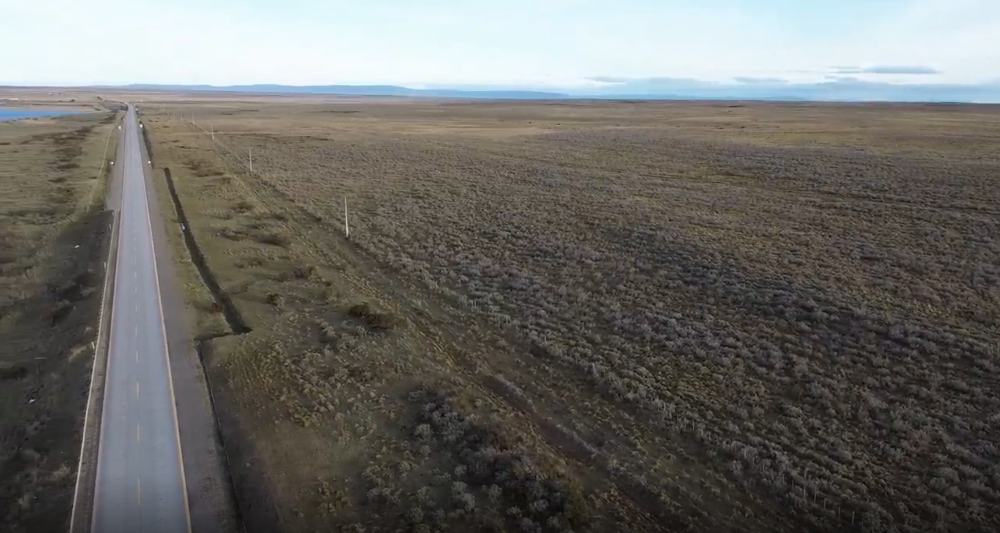
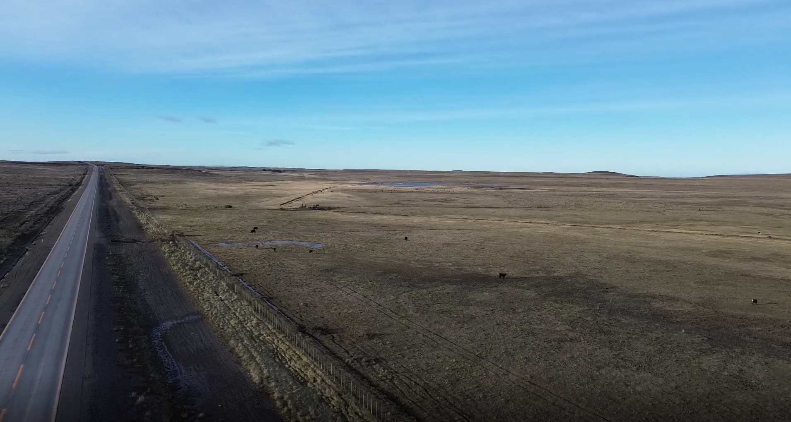
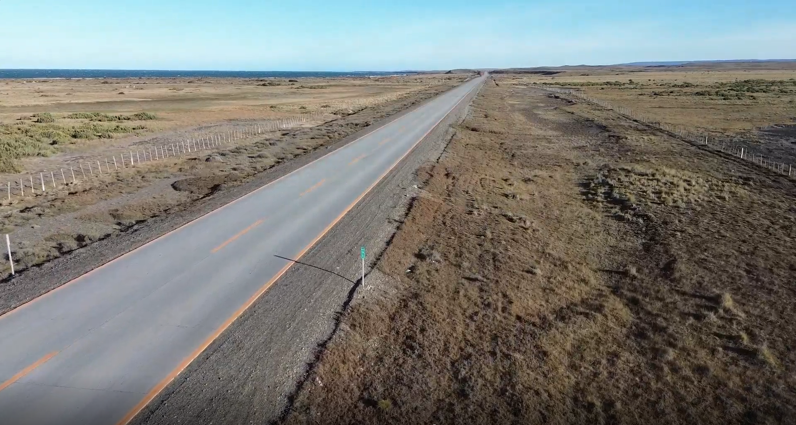

Este capítulo consolida los resultados de la campaña de levantamiento territorial realizada en la Provincia de Magallanes durante junio de 2026. Su función es cerrar el ciclo iniciado en la selección de cuencas, el protocolo IEO y la planificación logística: contrastar la señal satelital de resiliencia operativa (`RES`) con evidencia directa observada en terreno.

La campaña no se interpreta como una verificación mecánica del modelo. Se entiende como una prueba de coherencia entre dos escalas de observación: la MRCT, construida desde series satelitales anuales y métricas multivariadas, y el Índice de Estado Observado (IEO), levantado en sitio mediante rúbrica de vegetación, humedad, perturbación antrópica y fragmentación. En ese sentido, los resultados son relevantes tanto por las coincidencias como por las diferencias encontradas.

::: {.callout-note}
## Lectura general

El contraste IEO-`RES` muestra una consistencia estadística alta para las cuencas comparables: $r = 0{,}7869$, $R^2 = 0{,}6192$ y $p = 0{,}0069$ sobre 10 cuencas con valor satelital disponible. Esto valida la utilidad operativa de la MRCT como sistema de priorización, pero no elimina la necesidad de revisar escala, acceso, fecha de observación y condiciones locales en cada caso.
:::

## Resumen de campaña {#sec-resumen-campana-terreno}

La campaña se ejecutó en condiciones invernales severas, con jornadas de observación entre el 16 y el 18 de junio de 2026 y una ventana operativa general comprendida entre el 15 y el 19 de junio. El equipo base estuvo compuesto por John Treimun, Paula Altamirano y Denis Berroeta, con roles diferenciados de observación, operación de dron, navegación, registro y soporte logístico.

El diseño de levantamiento mantuvo una separación entre observación de terreno y conocimiento del modelo. El observador responsable de aplicar la rúbrica IEO no debía conocer los valores `RES`, jerk o clasificación MRCT antes de cerrar la ficha. Esta decisión metodológica es importante: reduce el riesgo de sesgo de confirmación y permite que la correlación posterior entre IEO y `RES` sea una prueba más exigente.

La cartera inicial contenía 17 cuencas preseleccionadas en @tbl-cuencas-seleccionadas-detalle. La campaña levantó 13 estaciones efectivas: 10 cuencas hidrográficas comparables con el modelo MRCT y 3 puntos urbanos o periurbanos usados como contraste territorial, pero sin valor `RES` comparable dentro del modelo de cuencas biofísicas.

| Grupo | Resultado de campaña |
|---|---:|
| Cuencas preseleccionadas para la campaña | 17 |
| Estaciones medidas en terreno | 13 |
| Cuencas con comparación IEO-`RES` | 10 |
| Puntos urbanos o periurbanos sin `RES` comparable | 3 |
| Cuencas de la cartera no visitadas en esta ventana | 7 |

: Síntesis de cobertura de la campaña de terreno. {#tbl-cobertura-campana-terreno}

Las cuencas comparables fueron `RID` 5263, 5623, 5624, 5294, 5247, 4996, 4982, 5257, 2205 y 1808. Las cuencas planificadas que no quedaron medidas en esta ventana fueron `RID` 5258, 1885, 1886, 3289, 5048, 5209 y 5626. Los puntos `RID` 0001, 2077 y 1928 corresponden a registros urbanos o de borde urbano donde el modelo de cuencas no entrega `RES` por dominancia de superficies impermeables o porque no corresponden a una cuenca biofísica comparable.

## Condiciones de levantamiento {#sec-condiciones-levantamiento-terreno}

La campaña funcionó como una prueba de esfuerzo para el protocolo. Se levantó información durante el invierno austral, con baja radiación, nubosidad alta, presencia de nieve en algunos sectores, temperaturas superficiales bajo cero y vientos fuertes. En San Gregorio se registraron condiciones de operación particularmente exigentes para el dron, con velocidades reportadas entre 50 y 100 km/h en varias estaciones. En Punta Arenas y Laredo las condiciones de viento fueron más favorables, aunque la nubosidad alcanzó 90-100% en los registros urbanos y periurbanos.

Esta condición invernal importa metodológicamente. La MRCT usa señales satelitales anuales y no pretende reproducir una fotografía instantánea del sitio. Por lo tanto, una observación hecha en junio puede mostrar nieve, senescencia, humedad congelada o baja actividad vegetal que no necesariamente equivale al estado promedio anual. Aun así, el contraste estadístico fue alto, lo que sugiere que la señal `RES` conserva capacidad de discriminar condiciones biofísicas incluso bajo ruido estacional.

| `RID` | Fecha / hora | Viento y operación dron | Nubosidad | Observación operativa |
|---:|---|---|---:|---|
| 5263 | 2026-06-16 / 11:35 | Dron con dificultad, 60 km/h | 1% | Condición ventosa pero registrable. |
| 5623 | 2026-06-16 / 12:32 | Dron con mayor dificultad, 80 km/h | 1% | Vuelo exigente; evidencia útil con cautela. |
| 5624 | 2026-06-16 / 12:46 | Dron con mucha dificultad, 100 km/h | 1% | Caso crítico para imagen aérea estable. |
| 5294 | 2026-06-16 / 12:55 | Dron con mayor dificultad, 80 km/h | 1% | Levantamiento condicionado por viento. |
| 5247 | 2026-06-16 / 13:45 | Vuelo normal, 30 km/h | 25% | Buena condición relativa. |
| 4996 | 2026-06-16 / 14:02 | Dron con dificultad, 60 km/h | 35% | Registro posible con limitación de viento. |
| 4982 | 2026-06-16 / 14:17 | Dron con dificultad, 50 km/h | 40% | Registro posible con limitación de viento. |
| 5257 | 2026-06-16 / 14:35 | Dron con dificultad, 60 km/h | 60% | Registro posible con nubosidad creciente. |
| 2205 | 2026-06-16 / 14:50 | Vuelo normal, 30 km/h | 70% | Registro operativo aceptable. |
| 1808 | 2026-06-17 / 09:12 | Vuelo normal, 10 km/h | 100% | Condición favorable de viento; nubosidad total. |

: Condiciones ambientales y operativas de las cuencas comparables con MRCT. {#tbl-condiciones-operativas-terreno}

## Resultados por cuenca {#sec-resultados-por-cuenca-terreno}

La tabla siguiente resume la base comparable entre el IEO observado y la resiliencia operativa `RES` del modelo. El IEO se calculó con la misma lógica definida en @sec-formula-ieo: vegetación y humedad suman como atributos positivos, mientras perturbación y fragmentación actúan como vectores negativos.

| `RID` | Comuna | V | H | P | F | IEO observado | `RES` modelo | Clave |
|---:|---|---:|---:|---:|---:|---:|---:|---|
| 5263 | San Gregorio | 2.0 | 2.0 | 4.0 | 3.0 | 0.3125 | 0.5593 | O |
| 5623 | San Gregorio | 2.5 | 2.0 | 4.0 | 3.0 | 0.3438 | 0.4959 | C |
| 5624 | San Gregorio | 2.0 | 2.0 | 4.5 | 3.0 | 0.2813 | 0.0335 | J |
| 5294 | San Gregorio | 2.0 | 2.0 | 4.0 | 3.0 | 0.3125 | 0.0149 | G |
| 5247 | San Gregorio | 2.5 | 3.0 | 3.5 | 3.0 | 0.4375 | 0.4720 | M |
| 4996 | San Gregorio | 1.0 | 2.0 | 4.0 | 3.0 | 0.2500 | 0.0054 | O |
| 4982 | San Gregorio | 1.0 | 2.0 | 4.0 | 3.0 | 0.2500 | 0.0046 | O |
| 5257 | San Gregorio | 2.0 | 2.0 | 3.5 | 3.0 | 0.3438 | 0.0093 | O |
| 2205 | Punta Arenas | 2.0 | 3.0 | 3.5 | 3.0 | 0.4063 | 0.0021 | O |
| 1808 | Punta Arenas | 5.0 | 4.0 | 2.0 | 2.0 | 0.8125 | 1.0000 | K |

: Base de validación IEO-`RES` para cuencas hidrográficas comparables. {#tbl-ieo-res-terreno}

El patrón principal es claro. Las cuencas con `RES` muy bajo tendieron a presentar IEO bajo o medio-bajo, con vegetación pobre a media, humedad limitada, perturbación antrópica moderada a alta y fragmentación visible. En contraste, `RID` 1808 mostró simultáneamente el mayor IEO observado y el valor máximo de `RES`, consistente con una señal de alta resiliencia operativa.

La relación no es perfecta, y no debe esperarse que lo sea. El IEO captura una condición local observada en una fecha específica y desde puntos accesibles. La MRCT sintetiza una trayectoria anual de cuenca completa. Aun así, la dirección general entre ambas mediciones es coherente y estadísticamente significativa.

## Evidencia visual por RID {#sec-evidencia-visual-rid-terreno}

Las imágenes siguientes complementan la ficha y la tabla IEO-`RES`. Muestran el entorno accesible desde el cual se obtuvo el registro, por lo que sirven para documentar cobertura, infraestructura y condiciones visibles, pero no representan por sí solas el polígono completo de cada cuenca. Cada lectura visual se vincula brevemente con el resultado, sin reemplazar el IEO ni la señal anual del modelo.

::: {.panel-tabset}

### RID 2205

{#fig-rid-2205-evidencia fig-align="center" width="100%"}

La imagen muestra una ruta pavimentada que atraviesa una matriz abierta de vegetación baja. Se distinguen cunetas o zanjas paralelas al camino, postes de tendido y una franja de borde intervenida por la infraestructura vial. Hacia el exterior del corredor predomina una cobertura baja y relativamente continua, sin elementos arbóreos visibles en el encuadre. Esta evidencia contextualiza la observación de perturbación y fragmentación registradas para la cuenca, sin asumir que el punto de acceso describe toda su extensión. En relación con el IEO medio-bajo (0.4063) y el `RES` muy bajo (0.0021), la escena muestra presiones visibles de borde, pero no un colapso visual uniforme; esa diferencia es coherente con la tensión de escala e intensidad discutida para el sitio.

### RID 5257

{#fig-rid-5257-evidencia fig-align="center" width="100%"}

La imagen registra un paisaje de pradera abierta, delimitado por cercos y atravesado por un corredor vial. Se observan animales en pastoreo, huellas de tránsito sobre el terreno y pequeños sectores con agua o humedad superficial próximos al borde del camino. La cobertura es predominantemente baja y el uso ganadero es visible; estos rasgos aportan contexto a la condición intermedia de humedad y a la perturbación observada, sin convertir la fotografía en una medición de la cuenca completa. Junto con el IEO de 0.3438 y el `RES` de 0.0093, la imagen ayuda a explicar una condición observada baja pero no homogéneamente degradada: combina señales de uso y fragmentación con sectores que conservan humedad superficial.

### RID 5294

{#fig-rid-5294-evidencia fig-align="center" width="100%"}

La fotografía muestra una planicie expuesta con vegetación baja, un camino pavimentado y cercos paralelos a la ruta. En los bordes se aprecian superficies de suelo más desnudo o con cobertura rala, además de una geometría lineal asociada al corredor vial. La escena hace visible la proximidad entre la observación y la infraestructura de transporte; por ello, la evidencia debe leerse junto con la ficha de sitio y no como una caracterización total de la cuenca. La baja cobertura visible y el corredor lineal son compatibles con el IEO bajo (0.3125) y el `RES` muy bajo (0.0149); al mismo tiempo, la imagen recuerda que un valor crítico del modelo no equivale necesariamente a una imagen de deterioro total en un único punto de acceso.

### RID 1808

{#fig-rid-1808-evidencia fig-align="center" width="100%"}

La imagen muestra una ladera con cobertura arbórea, parches de nieve y un camino sinuoso que desciende hacia un área urbanizada o costera visible al fondo. También se distingue una franja abierta en la ladera y la cercanía entre bosque, camino y ocupación del borde. En este encuadre se observan elementos coherentes con una cobertura más densa y húmeda que la de las praderas abiertas; la interpretación final sigue correspondiendo a la ficha y al IEO de la cuenca, no sólo a la fotografía. Esta lectura visual se alinea con el IEO más alto de la campaña (0.8125) y `RES = 1.0000`: el caso de control positivo conserva una cobertura arbórea continua en el encuadre, aun bajo condiciones invernales y junto a un camino de acceso.

:::

## Contraste estadístico IEO-RES {#sec-contraste-ieo-res-terreno}

El contraste lineal entre IEO observado y `RES` modelo se calculó sobre las 10 cuencas con ambos datos disponibles. Los tres puntos urbanos o periurbanos sin `RES` no fueron incluidos, porque no pertenecen al mismo dominio de inferencia del modelo de cuencas.

| Métrica | Valor | Lectura |
|---|---:|---|
| N comparable | 10 | Muestra de cuencas con IEO y `RES`. |
| Correlación de Pearson | 0.7869 | Asociación positiva alta entre observación y modelo. |
| $R^2$ | 0.6192 | Aproximadamente 62% de la variación del IEO queda explicada por `RES` en el ajuste lineal. |
| Valor p | 0.0069 | Relación estadísticamente significativa bajo $p < 0.01$. |
| Error estándar | 0.1194 | Magnitud del desajuste esperado alrededor de la recta. |

: Resultados del contraste estadístico entre IEO observado y `RES` modelo. {#tbl-contraste-estadistico-ieo-res}

Estos valores permiten sostener una validación empírica fuerte para el uso de la MRCT como herramienta de priorización territorial. La evidencia no prueba causalidad ni reemplaza el análisis ecológico de detalle, pero sí confirma que la resiliencia operativa estimada por el modelo se ordena de manera compatible con condiciones físicas observadas en terreno.

## Síntesis de mediciones {#sec-sintesis-mediciones-terreno}

La síntesis de mediciones muestra que el levantamiento produjo una base integrada suficiente para comparar cuencas en tres planos: condición biofísica observada, restricción operativa de campaña y señal satelital. Para el cierre del libro, la variable central es el IEO promedio por cuenca; las condiciones de viento, nubosidad y operación de dron se usan como metadatos de interpretación.

| Dimensión | Resultado integrado |
|---|---|
| Condición observada | IEO entre 0.2500 y 0.8125 en las cuencas comparables. |
| Señal satelital | `RES` entre 0.0021 y 1.0000. |
| Restricción de vuelo | Viento crítico en varias cuencas de San Gregorio; condición más favorable en Punta Arenas / Laredo. |
| Comparabilidad | 10 cuencas comparables con MRCT; 3 puntos urbanos o periurbanos registrados como evidencia territorial no comparable con `RES`. |
| Uso metodológico | Validación estadística, clasificación de consistencia y lectura de discrepancias. |

: Síntesis operativa de mediciones de terreno para integración MRCT. {#tbl-sintesis-mediciones-terreno}

## Coherencias encontradas {#sec-coherencias-terreno}

Las principales coherencias entre lo esperado por la MRCT y lo observado en terreno son las siguientes.

Primero, la dirección general de la señal fue correcta. Las cuencas clasificadas con resiliencia operativa muy baja se asociaron con IEO bajo, perturbación antrópica visible, fragmentación y menor vigor de cobertura. Esto es consistente con la lectura de @sec-resiliencia-operativa: `RES` no declara un estado ecológico absoluto, pero ordena unidades territoriales según presión de transición.

Segundo, los casos de resiliencia media se ubicaron en posiciones intermedias. `RID` 5247, 5623 y 5263 no mostraron condiciones tan críticas como las cuencas de `RES` cercano a cero, pero tampoco aparecieron como sitios de alta integridad. Esta gradación es importante porque confirma que el modelo no sólo separa extremos, sino que también captura estados intermedios.

Tercero, `RID` 1808 funcionó como caso de control positivo. El terreno mostró alta vegetación, humedad relevante, baja perturbación relativa y menor fragmentación, mientras el modelo entregó `RES = 1.0000`. La coincidencia es metodológicamente útil porque evita que la campaña sólo valide cuencas críticas; también prueba que la MRCT reconoce condiciones favorables.

Cuarto, la exclusión de puntos urbanos sin `RES` es coherente con el alcance del modelo. En superficies impermeabilizadas o urbanas consolidadas, la lógica de cuenca biofísica pierde comparabilidad directa. Que esos puntos aparezcan como `N/A` no es una falla de la MRCT, sino una delimitación correcta de su dominio de aplicación.

## Inconsistencias y tensiones interpretativas {#sec-inconsistencias-terreno}

Las diferencias más relevantes no invalidan el modelo, pero sí afinan su lectura.

La primera tensión aparece en cuencas con IEO medio-bajo pero `RES` extremadamente bajo, como `RID` 2205, 5257 o 5294. En esos casos, el terreno no necesariamente mostró un colapso visual total, pero sí condiciones compatibles con presión: perturbación, fragmentación, baja cobertura o humedad parcial. La diferencia sugiere que `RES` puede estar capturando trayectoria, sensibilidad o alejamiento multivariado acumulado que no siempre se ve como deterioro extremo en una sola visita.

La segunda tensión se relaciona con la fecha de observación. La campaña se realizó en invierno, mientras la MRCT integra señales anuales. Nieve, senescencia, suelo congelado, baja luz y nubosidad pueden modificar la apariencia instantánea del paisaje. Por eso, una discrepancia puntual debe revisarse contra la serie temporal, el año crítico de jerk, la imagen satelital usada y la estacionalidad de la cobertura.

La tercera tensión es espacial. El punto accesible no siempre representa la cuenca completa. Varias cuencas fueron observadas desde bordes, caminos o sectores seguros de detención. En cuencas heterogéneas, el IEO local puede subestimar o sobreestimar procesos que la MRCT calcula para el polígono completo.

La cuarta tensión es logística. El viento condicionó la calidad y estabilidad del registro aéreo, especialmente en `RID` 5624. Esto no afecta necesariamente el IEO peatonal, pero sí reduce la capacidad de leer continuidad espacial, cauces, fragmentación y estructura de cobertura desde dron.

## Lectura metodológica de lo esperado y lo encontrado {#sec-lectura-esperado-encontrado}

Antes de la campaña, la MRCT esperaba encontrar un conjunto de cuencas útil para contrastar tres situaciones: resiliencia alta, resiliencia media y colapso potencial o transición acelerada. También se esperaba que la validación no dependiera de una sola variable visible, sino de la combinación entre vegetación, humedad, perturbación y fragmentación.

Lo encontrado confirma esa expectativa general. La campaña no produjo una correspondencia perfecta punto a punto, pero sí una relación fuerte entre el ordenamiento satelital y la condición observada. En términos prácticos, la MRCT acertó en la pregunta más importante para planificación: dónde mirar primero y qué sitios merecen revisión prioritaria.

La inconsistencia más valiosa es conceptual: un `RES` bajo no siempre se ve en terreno como una imagen simple de degradación absoluta. Puede expresarse como presión acumulada, fragmentación, pérdida de humedad, trayectoria acelerada, contraste con la línea base o sensibilidad a forzantes. Esto refuerza una idea ya planteada en el libro: la MRCT no debe leerse como sentencia visual, sino como sistema de preguntas territorialmente trazables.

## Limitaciones de campaña {#sec-limitaciones-campana-terreno}

La campaña deja cuatro limitaciones principales para la lectura final.

Primero, la muestra comparable es pequeña. Diez cuencas permiten una validación inicial sólida, pero no reemplazan una campaña ampliada con más comunas, estaciones y tipos de cobertura.

Segundo, la ventana temporal fue invernal. Esto es una fortaleza como prueba de esfuerzo, pero también impone cautela para interpretar vigor vegetal, nieve, agua superficial y temperatura de coberturas.

Tercero, no todas las cuencas preseleccionadas fueron visitadas. La priorización logística redujo la cartera inicial a un subconjunto efectivo; por lo tanto, las cuencas no visitadas deben mantenerse como candidatas para una segunda campaña o para validación remota complementaria.

Cuarto, las condiciones de viento afectaron la operación de dron. En general se obtuvo evidencia funcional, pero la calidad del registro aéreo fue variable y en `RID` 5624 el viento limitó la estabilización de cámara.

## Cierre de resultados {#sec-cierre-resultados-terreno}

El resultado central de la campaña es que la MRCT mostró consistencia empírica bajo condiciones difíciles. El modelo ordenó las cuencas de manera compatible con el estado observado y mantuvo una asociación estadísticamente significativa con el IEO, aun cuando el levantamiento se realizó en invierno, con vientos intensos y sobre una muestra operacionalmente acotada.

La conclusión metodológica no es que la MRCT reemplaza al terreno. Es lo contrario: el terreno confirma que la MRCT sirve para focalizar la observación, distinguir prioridades y formular hipótesis verificables. Las coincidencias fortalecen la confianza en el modelo; las diferencias entregan información para mejorar su interpretación, ajustar campañas futuras y evitar lecturas simplistas de una métrica que, por diseño, sintetiza procesos multivariados, espaciales y temporales.
